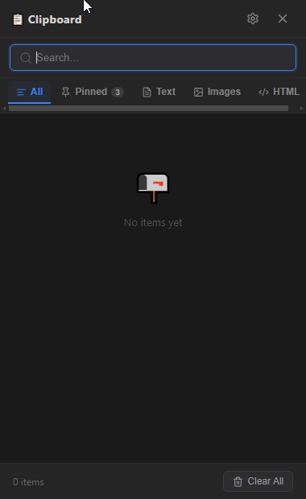
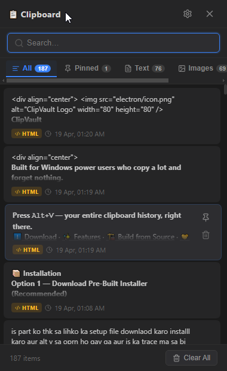
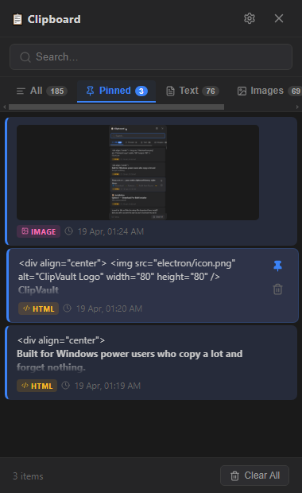
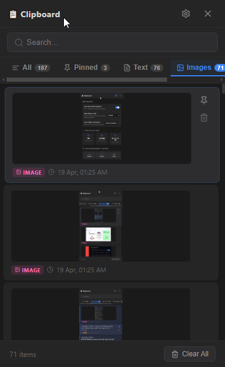
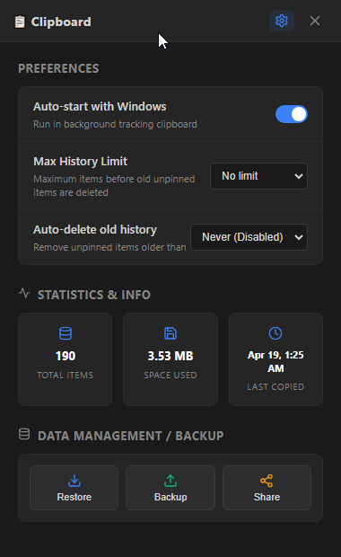

<div align="center">


# ClipVault

### A blazing-fast, privacy-first clipboard manager for Windows

[](https://github.com/yourusername/clipvault/releases)
[](https://www.electronjs.org/)
[](https://react.dev/)
[](https://www.typescriptlang.org/)
[](https://www.sqlite.org/)
[](LICENSE)
[](https://github.com/yourusername/clipvault/releases/latest)

---







</div>

---

## ✨ Why ClipVault?

Windows gives you exactly **one** clipboard slot. Copy something new and the previous item is gone forever. ClipVault runs silently in the background and saves **everything** you copy — plain text, rich HTML, and images — into a local SQLite database that only you can access.

No cloud. No account. No telemetry. Just your clipboard history, always available.

---

## 🚀 Features

### Core
| Feature | Details |
|---|---|
| **Universal Capture** | Automatically captures plain text, rich HTML, and images the moment you copy |
| **`Alt+V` Hotkey** | Opens the panel from anywhere  no mouse, no window switching |
| **Smart Auto-Paste** | Remembers the last focused window and fires `Ctrl+V` directly into it via Win32 APIs |
| **Real-time Search** | Instantly search across thousands of clipboard items |
| **Pin Items** | Pinned items stay at the top and are never auto-deleted |
| **Format Tabs** | Filter your history by All / Text / HTML / Image |

### Storage & Performance
| Feature | Details |
|---|---|
| **SQLite + WAL Mode** | Crash-safe Write-Ahead Logging for high-performance local storage |
| **Up to 10,000 items** | Configurable history limit  oldest unpinned items removed automatically |
| **Auto-Delete by Age** | Optionally purge items older than N days |
| **Duplicate Detection** | Copying the same content twice just refreshes its timestamp no clutter |
| **Safe Storage Location** | Database lives in `%APPDATA%\clipboard-manager\` untouched by disk cleanup tools |

### Backup & Management
| Feature | Details |
|---|---|
| **JSON Backup** | Export your full history to a `.json` file and restore it anytime |
| **Share as Text** | Export text items as a readable `.txt` file |
| **Stats Panel** | View total item count, last copied time, and database size |

### System
| Feature | Details |
|---|---|
| **System Tray** | Runs as a tray icon zero taskbar clutter |
| **Auto-Start** | Launches silently at Windows startup |
| **Smart Positioning** | Panel opens near your cursor and auto-adjusts to stay on screen |
| **Blur to Close** | Click anywhere outside the panel and it disappears |

---

## 📦 Installation

### Option 1 Installer (Recommended)

**1. Download**
Go to [**Releases**](https://github.com/yourusername/clipvault/releases/latest) and download **`ClipVault-Setup-x.x.x.exe`**

**2. Run the installer**
Double-click the `.exe` file, then follow these steps:
- Click **Next** on the welcome screen
- Choose install folder (default is fine) → **Next**
- Click **Install**
- Click **Finish**

**3. Done — ClipVault is now running**
No window will appear. ClipVault starts silently in the background and begins saving your clipboard history immediately.

---

**Finding ClipVault in the system tray**

After install, look at the **bottom-right corner** of your screen, next to the clock:

```
 ___________________________________________________________
|                                            ^ 📋 🔊  12:00 |
|                                            ↑              |
|                               Click ^ to expand tray icons|
|                               ClipVault icon will be here |
|___________________________________________________________|
```

- 🖱️ **Left-click** the icon → toggle the clipboard panel open/close
- 🖱️ **Right-click** the icon → Open or Quit

> **Icon not visible?** Click the **`^`** arrow on the taskbar to show hidden tray icons.

---

**Opening ClipVault with the hotkey**

Press **`Alt + V`** from anywhere  while typing, coding, or browsing. The panel appears instantly near your cursor. Click any item to paste it back into your previous window. Press **`Alt + V`** again or click outside to close.

---

> **⚠️ Windows SmartScreen**
>
> Windows may show *"Windows protected your PC"* on first launch. This happens because the app is not yet commercially code-signed it does not mean the app is unsafe.
>
> To proceed: click **"More info"** → then **"Run anyway"**
>
> The full source code is open and auditable right here on GitHub.

---

## 🔧 Configuration

Press **`Alt+V`** → click the **⚙ Settings** icon inside the panel.

| Setting | Default | Description |
|---|---|---|
| Auto-Start with Windows | ✅ On | Launch ClipVault silently on login |
| Max History Items | `10,000` | Oldest unpinned items removed when limit is hit |
| Auto-Delete After | Off | Remove items older than N days automatically |

Settings are saved to `%APPDATA%\clipboard-manager\preferences.json`.

---

## 🛡️ Privacy & Security

- **Fully offline** — no internet access, no analytics, no crash reporting, ever
- **Your data stays on your machine** — nothing is uploaded anywhere
- **Context Isolation** — `contextIsolation: true` and `nodeIntegration: false` keep the renderer sandboxed
- **DOMPurify** — all HTML content is sanitized before rendering to prevent XSS
- **Hidden storage** — database is stored in `%APPDATA%`, not your Documents or Desktop

---

## 🖥️ How Native Paste Works

ClipVault ships with three tiny C# executables that talk to Windows directly via Win32 APIs:

- **`GetHwnd.exe`** — runs just before the panel opens, captures the HWND of your currently focused window via `GetForegroundWindow()`
- **`WinHelper.exe`** — after you click an item, ClipVault writes to the clipboard, hides itself, then calls this helper with the saved HWND to `SetForegroundWindow()` and fire `Ctrl+V` via `keybd_event()`

This is how ClipVault pastes directly into VS Code, Chrome, Notepad, or any app — without you clicking back into it manually.

---

## 🏗️ Build from Source

### Prerequisites

| Tool | Version |
|---|---|
| Node.js | `>= 18.x` |
| npm | `>= 9.x` |
| .NET SDK | `>= 6.0` |
| OS | Windows 10 / 11 |

### Steps

```bash
# Clone
git clone https://github.com/yourusername/clipvault.git
cd clipvault

# Install dependencies
npm install

# Compile C# native helpers
csc /out:GetHwnd.exe GetHwnd.cs
csc /out:WinHelper.exe WinHelper.cs
csc /out:PasteHelper.exe PasteHelper.cs

# Run in development (hot reload)
npm run dev

# Build production installer → output in /release
npm run build
```

### Project Structure

```
clipvault/
├── electron/
│   ├── main.js          # App lifecycle, tray, hotkey, IPC, clipboard monitor
│   ├── db.js            # SQLite layer — all read/write operations
│   ├── preload.js       # Secure IPC bridge (main ↔ renderer)
│   └── store.js         # electron-store for user settings
├── src/
│   ├── App.tsx          # Main React UI — list, search, tabs, settings
│   ├── App.css          # Dark theme
│   └── main.tsx         # React entry point
├── GetHwnd.cs           # Win32: get foreground window handle
├── WinHelper.cs         # Win32: focus window + send Ctrl+V
├── PasteHelper.cs       # Win32: paste helper
└── vite.config.ts
```

---

## 🛠️ Tech Stack

| Layer | Technology |
|---|---|
| App Shell | [Electron 30](https://www.electronjs.org/) |
| Frontend | [React 18](https://react.dev/) + [TypeScript 5.4](https://www.typescriptlang.org/) |
| Bundler | [Vite 5](https://vitejs.dev/) |
| Database | [better-sqlite3](https://github.com/WiseLibs/better-sqlite3) (WAL mode) |
| Settings | [electron-store](https://github.com/sindresorhus/electron-store) |
| Icons | [Lucide React](https://lucide.dev/) |
| HTML Sanitization | [DOMPurify](https://github.com/cure53/DOMPurify) |
| Native Helpers | C# / Win32 `user32.dll` |
| Packaging | [electron-builder](https://www.electron.build/) |

---

## 🗺️ Roadmap

- [ ] Custom hotkey configuration
- [ ] Regex search support
- [ ] Item categories and tags
- [ ] OCR — extract text from copied screenshots
- [ ] Light theme option

---

## 🤝 Contributing

PRs are welcome. For major changes, open an issue first to discuss.

```bash
git clone https://github.com/yourusername/clipvault.git
cd clipvault
npm install
npm run dev
```

---

## 📄 License

MIT — see [LICENSE](LICENSE)
